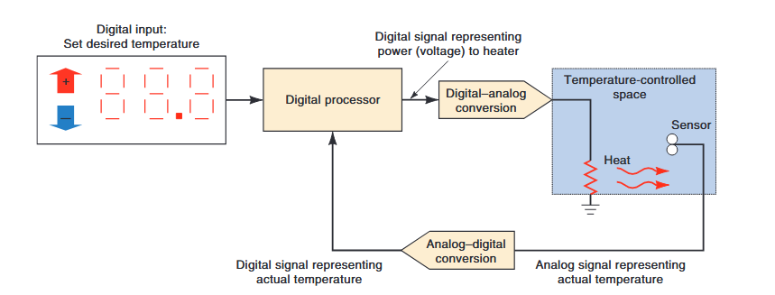

# Digital Systems

## Numerical Representation

We are constantly dealing with quantities. Quantities are measured, monitored, recorded, manipulated arithmetically, observed, or in some other way utilized in most physical systems. There are two ways of representing numerical value of quantities: analog and digital.

**Analog Signal:** A signal whose amplitude can take any value within a given range.
**Digital Signal:** A signal whose amplitude can take only finite number of values/discrete values.

### Analog Representation

In analog representation a quantity is represented by a continuously variable, proportional indicator. An example is an automobile speedometer from the classic muscle cars. Analog quantities can vary over a continuous range of values.

In electrical analog systems, the physical quantity that is being measured or processed is converted to a proportional voltage or current (electrical signal). This voltage or current is then used by the system for display, processing,or control purposes.

### Digital Representation

In digital representation the quantities are represented not by continuously variable indicators but by symbols called digits. An example is a digital clock, which provides the time of day in the form of decimal digits that represent hours and minutes. Digital representation is discrete or step by step representations. For this reason, there is no ambiguity when reading the value of a digital quantity.

```
analog == continuous
digital == discrete
```

## Analog System and Digital System

A digital system is a combination of devices designed to manipulate logical information or physical quantities that are represented in digital form; that is, the quantities can take on only discrete values.

An analog system contains devices that manipulate quantities that are represented in analog form. These quantities can vary over a continuous range of values.

### Advantages of Digital Techniques

* Digital systems are generally easier to design.
* Information storage is easy.
* Accuracy and precision are easier to maintain throughout the system.
* Operation can be programmed.
* Digital circuits are less affected by noise.
* More digital circuitry can be fabricated on IC chips.

### Limitations of Digital Techniques

* The real world is analog.
* Processing digitized signals takes time.
* Digitizing real world signals can introduce errors.

## Difference Between Analog and Digital Systems

| Analog System | Digital System |
|---------------|----------------|
| Analog systems are continuous in nature. | Digital systems are discrete in nature. |
| Analog systems are more prone to noise. | Digital systems are less prone to noise. |
| Analog systems are less accurate. | Digital systems are more accurate. |
| Analog systems are more complex. | Digital systems are less complex. |
| Need more power. | Need less power. |
| Used in audio systems, temperature control systems, etc. | Used in computers, calculators, etc. |

## Interfacing With Real-World

Steps to follow to deal with analog input and output:

* Convert the physical variable to an electrical signal (analog).
* Convert the electrical (analog) signal into digital form.
* Process (operate on) the digital information.
* Convert the digital outputs back to real-world analog form.

```text
[Physical Variable] -> [Analog Signal (Transducer)] -> [Analog to Digital Converter] -> 
[Digital Processor] -> [Digital to Analog Converter] -> [Physical Variable (Actuator)]
```

<figure><figcaption><p>Interfacing With Real World</p></figcaption></figure>

A transducer is a device that converts a physical variable into an electrical signal. An example is a temperature sensor that converts temperature into an electrical signal.

An actuators is a device that converts an electrical signal into a physical variable. An example is a motor that converts electrical signal into motion.

**A precision temperature regulation system:**

<figure><figcaption><p>Temperature Regulation System</p></figcaption></figure>


## Combinational & Sequential Logic

In combinational logic, the outputs depend only on the current inputs. 

In sequential logic, the outputs depend on the current inputs and the past inputs. Meaning, we have memory to store the past inputs. The memory is in the form of flip-flops.

## Difference Between Microprocessor and Microcontroller

| Microprocessor | Microcontroller |
|----------------|-----------------|
| It is a single-chip CPU. | It is a single-chip CPU with built-in RAM, ROM, I/O ports, and timers. |
| It requires external memory. | It has built-in memory. |
| It is used in personal computers. | It is used in embedded systems. |
| It is used in applications where cost is not a major concern. | It is used in applications where cost is a major concern. |
| It consumes more power. | It consumes less power. |
| High processing speed. | Low processing speed. |

