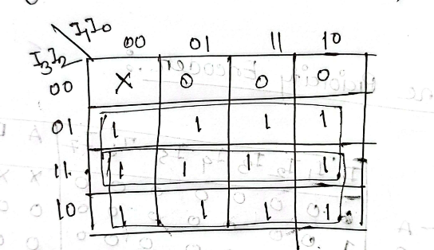

# Encoder

An encoder is a combinational circuit that converts binary information in the form of a $$2^n$$ input lines into $$n$$ output lines, which represent n bit binary code for the input.
For example, a 4-to-2 line encoder has 4 input lines and 2 output lines. The output lines generate the binary code corresponding to the input value. For a 8-to-3 line encoder, the input lines are 8 and the output lines are 3.

<figure><figcaption>
Encoder
</figcaption></figure>

Encoders play a crucial role in various applications. They are commonly used in data transmission systems where they help in reducing the amount of data to be transmitted by converting it into a binary format. They are also used in data storage solutions to encode data before it is stored, ensuring efficient use of storage space.

There four types of encoders:

1. Priority Encoder
2. Decimal to BCD Encoder
3. Octal to Binary Encoder
4. Hexadecimal to Binary Encoder

## Priority Encoder

A priority encoder is a circuit that has multiple inputs and a single output. It is used to convert the `highest priority` input line into a binary code. The highest priority input line is the one with the highest value. 

### What is the main disadvantage of an encoder? How a priority encoder can overcome this disadvantage?

The main disadvantage of an encoder is that it can only encode one input at a time. If multiple inputs are active at the same time, the encoder will not be able to determine which input to encode. A priority encoder overcomes this disadvantage by encoding the input with the highest priority. It determines the highest priority input and encodes it into a binary code, ignoring the other inputs.

Another disadvantage is that when D0 is active and other inputs are inactive, the encoder will output 0, and when all inputs are inactive, the encoder will also output 0. This can lead to ambiguity in the output.

### 4-to-2 Line Priority Encoder

The block diagram of a 4-to-2 line priority encoder is shown below:

<figure><figcaption>
Priority Encoder
</figcaption></figure>

In the figure, the inputs are I0, I1, I2, and I3. The outputs are Y0 and Y1. I0 is the least significant bit(lowest priority) and I3 is the most significant bit(highest priority). The output Y1 is the most significant bit and Y0 is the least significant bit.

**Truth Table:**

The truth table for a 4-to-2 line priority encoder is shown below:

$$
\begin{array}{|cccc|cc|}
\hline
I_3 & I_2 & I_1 & I_0 & Y_1 & Y_0 \\
\hline
0 & 0 & 0 & 0 & X & X \\
0 & 0 & 0 & 1 & 0 & 0 \\
0 & 0 & 1 & X & 0 & 1 \\
0 & 1 & X & X & 1 & 0 \\
1 & X & X & X & 1 & 1 \\
\hline
\end{array}
$$

The K-map for the output $$Y_1$$ is shown below:

<figure><figcaption>
K-map for Y1
</figcaption></figure>

The boolean expression for $$Y_1$$ is:
$$
Y_1 = I_2 + I_3
$$

The K-map for the output $$Y_0$$ is shown below:

<figure><figcaption>
K-map for Y1
</figcaption></figure>

The boolean expression for $$Y_0$$ is:
$$
Y_0 = I_3 + I_1I_2'
$$

The circuit diagram for a 4-to-2 line priority encoder is shown below:

<figure><figcaption>
Priority Encoder Circuit
</figcaption></figure>

### Advantages of Priority Encoder

1. It is used to encode multiple inputs into a binary code.
2. It is used to determine the highest priority input.
3. It is used in microprocessors to determine the highest priority interrupt.

### Disadvantages of Priority Encoder

1. It is complex to design and implement.
2. It requires more hardware resources.

## Decimal to BCD Encoder

A decimal to BCD encoder is a circuit that has 10 input lines and 4 output lines. It is used to convert a decimal number into a binary-coded decimal (BCD) number. The BCD number is a binary representation of a decimal number. The input lines are from 0 to 9 and the output lines are A, B, C, and D.

### Block Diagram - Decimal to BCD Encoder

The block diagram of a decimal to BCD encoder is shown below:

<figure><figcaption>
Decimal to BCD Encoder
</figcaption></figure>

In the figure, the inputs are 0, 1, 2, 3, 4, 5, 6, 7, 8, and 9. The outputs are A, B, C, and D. The input 0 is the least significant bit and the input 9 is the most significant bit. The output D is the most significant bit and the output A is the least significant bit.

### Truth Table - Decimal to BCD Encoder

The truth table for a decimal to BCD encoder is shown below:

$$
\begin{array}{|c|cccc|}
\hline
Input(High) & D & C & B & A \\
\hline
D_0 & 0 & 0 & 0 & 0 \\
D_1 & 0 & 0 & 0 & 1 \\
D_2 & 0 & 0 & 1 & 0 \\
D_3 & 0 & 0 & 1 & 1 \\
D_4 & 0 & 1 & 0 & 0 \\
D_5 & 0 & 1 & 0 & 1 \\
D_6 & 0 & 1 & 1 & 0 \\
D_7 & 0 & 1 & 1 & 1 \\
D_8 & 1 & 0 & 0 & 0 \\
D_9 & 1 & 0 & 0 & 1 \\
\hline
\end{array}
$$

$$
\begin{align*}
D &= 1, \text{ if input is 8 or 9} \\
C &= 1, \text{ if input is 4, 5, 6, or 7} \\
B &= 1, \text{ if input is 2, 3, 6, or 7} \\
A &= 1, \text{ if input is 1, 3, 5, 7, or 9} \\
\end{align*}
$$

The circuit diagram for a decimal to BCD encoder is shown below:

<figure><figcaption>
Decimal to BCD Encoder Circuit
</figcaption></figure>

## Octal to Binary Encoder

An octal to binary encoder is a circuit that has 8 input lines and 3 output lines. It is used to convert an octal number into a binary number. The octal number is a base-8 number and the binary number is a base-2 number. The input lines are from 0 to 7 and the output lines are A, B, and C.

### Block Diagram - Octal to Binary Encoder

The block diagram of an octal to binary encoder is shown below:

<figure><figcaption>
Octal to Binary Encoder
</figcaption></figure>

In the figure, the inputs are 0, 1, 2, 3, 4, 5, 6, and 7. The outputs are A, B, and C. The input 0 is the least significant bit and the input 7 is the most significant bit. The output C is the most significant bit and the output A is the least significant bit.

### Truth Table - Octal to Binary Encoder

The truth table for an octal to binary encoder is shown below:

$$
\begin{array}{|c|ccc|}
\hline
Input & C & B & A \\
\hline
0 & 0 & 0 & 0 \\
1 & 0 & 0 & 1 \\
2 & 0 & 1 & 0 \\
3 & 0 & 1 & 1 \\
4 & 1 & 0 & 0 \\
5 & 1 & 0 & 1 \\
6 & 1 & 1 & 0 \\
7 & 1 & 1 & 1 \\
\hline
\end{array}
$$

$$
\begin{align*}
C &= 1, \text{ if input is 4, 5, 6, or 7} \\
B &= 1, \text{ if input is 2, 3, 6, or 7} \\
A &= 1, \text{ if input is 1, 3, 5, or 7} \\
\end{align*}
$$

## Hexadecimal to Binary Encoder

A hexadecimal to binary encoder is a circuit that has 16 input lines and 4 output lines. It is used to convert a hexadecimal number into a binary number. The hexadecimal number is a base-16 number and the binary number is a base-2 number. The input lines are from 0 to F and the output lines are B3, B2, B1, and B0.

### Block Diagram - Hexadecimal to Binary Encoder

The block diagram of a hexadecimal to binary encoder is shown below:

<figure><figcaption>
Hexadecimal to Binary Encoder
</figcaption></figure>

In the figure, the inputs are 0, 1, 2, 3, 4, 5, 6, 7, 8, 9, A, B, C, D, E, and F. The outputs are B3, B2, B1, and B0. The input 0 is the least significant bit and the input F is the most significant bit. The output B3 is the most significant bit and the output B0 is the least significant bit.

### Truth Table - Hexadecimal to Binary Encoder

The truth table for a hexadecimal to binary encoder is shown below:

$$
\begin{array}{|c|cccc|}
\hline
Input & B3 & B2 & B1 & B0 \\
\hline
0 & 0 & 0 & 0 & 0 \\
1 & 0 & 0 & 0 & 1 \\
2 & 0 & 0 & 1 & 0 \\
3 & 0 & 0 & 1 & 1 \\
4 & 0 & 1 & 0 & 0 \\
5 & 0 & 1 & 0 & 1 \\
6 & 0 & 1 & 1 & 0 \\
7 & 0 & 1 & 1 & 1 \\
8 & 1 & 0 & 0 & 0 \\
9 & 1 & 0 & 0 & 1 \\
A & 1 & 0 & 1 & 0 \\
B & 1 & 0 & 1 & 1 \\
C & 1 & 1 & 0 & 0 \\
D & 1 & 1 & 0 & 1 \\
E & 1 & 1 & 1 & 0 \\
F & 1 & 1 & 1 & 1 \\
\hline
\end{array}
$$

The boolean expressions for B3, B2, B1, and B0 are:
$$
\begin{align*}
B3 &= 1, \text{ if input is 8, 9, A, B, C, D, E, or F} \\
B2 &= 1, \text{ if input is 4, 5, 6, 7, C, D, E, or F} \\
B1 &= 1, \text{ if input is 2, 3, 6, 7, A, B, E, or F} \\
B0 &= 1, \text{ if input is 1, 3, 5, 7, 9, B, D, or F} \\
\end{align*}
$$

