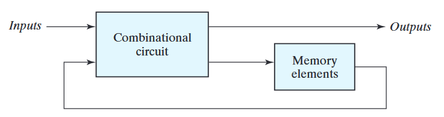

# Sequential Circuits

> In sequential circuits, the present output depends on the present input as well as past output/outputs.

A sequential circuit is a type of digital circuit which responds not only to the present inputs, but to the present state (or past output) of the circuit. The output of a sequential circuit is a function of the inputs and the state of the circuit. The state of the circuit is the collection of the present values of the flip-flops in the circuit.

A sequential circuit can be classified into two types:

1. Asynchronous Sequential Circuit
2. Synchronous Sequential Circuit

The past outputs are stored in memory.
<figure><figcaption>
Sequential Circuit
</figcaption></figure>

## Asynchronous Sequential Circuit

In an asynchronous sequential circuit, the state of the circuit changes continuously in response to the inputs. The state of the circuit changes as soon as the inputs change. The state of the circuit changes independently of the clock signal.

## Synchronous Sequential Circuit

In a synchronous sequential circuit, the state of the circuit changes only at discrete instants of time. The state of the circuit changes in response to the clock signal. The clock signal is a periodic signal that oscillates between high and low states. The state of the circuit changes only when the clock signal transitions from low to high (rising edge) or high to low (falling edge).

## Duty Cycle

The duty cycle of a periodic signal is the ratio of the time the signal is high to the total time period of the signal. The duty cycle is expressed as a percentage. It is used to measure the stability of the clock signal. The duty cycle should be 50% for a stable clock signal.The duty cycle of a periodic signal is given by:

$$
\text{Duty Cycle} = \frac{\text{High Time}}{\text{Total Time}} \times 100
$$

## Clock signal

The clock signal is used to synchronize the operation of the sequential circuits. The clock signal is a square wave signal. It is a periodic train of pulses which changes its states between the logic 1 and logic 0. It has 4 states: rising edge, falling edge, high state, and low state.

## Triggering Methods

1. Edge triggering: The flip-flop is triggered by the rising edge or falling edge of the clock signal.
2. Level triggering: The latch is triggered by the level of the clock signal.

Edge triggering is used in flip-flops. It has two types: positive edge triggering and negative edge triggering. In positive edge triggering, the output changes at the rising edge of the clock signal. In negative edge triggering, the output changes at the falling edge of the clock signal.

Level triggering is used in latches. The output changes when the clock signal is high level or low level.

## Latch and Flip-Flop

Latches and flip-flops are the basic building blocks of sequential circuits. They are used to store the data in the sequential circuits. They are bistable multivibrators. They have two stable states: set state and reset state. They can store one bit of data(0 or 1).

The main difference between latch and flip-flop is that the latch is level triggered and flip-flop is edge triggered. The latch is faster than flip-flop, but flip-flop is more reliable than latch. Flip-flop is used in synchronous circuits and latch is used in asynchronous circuits.

## Differnce between latch and flip-flop

1. Latch is level triggered and flip-flop is edge triggered.
2. Latch is faster than flip-flop.
3. Flip-flop is more reliable than latch.
4. Flip-flop is used in synchronous circuits and latch is used in asynchronous circuits.
