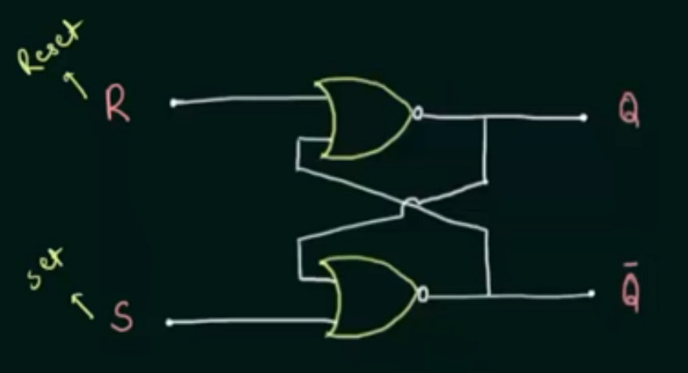

# SR Latch

A latch is a memory device that stores the data in the form of 0s and 1s. It is a bistable device, i.e., it has two stable states. It can store one bit of data. The stored data can be changed by applying the appropriate inputs.

The SR latch is a circuit with two cross-coupled NOR gates or two cross-coupled NAND gates, and two inputs S(for set) and R(for reset). The output of one gate is connected to the input of the other gate and vice versa. The output of the first gate is Q and the output of the second gate is Q'. 

## Types of Latches

1. **SR Latch**: It has two inputs: S and R. It has two outputs: Q and Q'. It has two stable states: Set and Reset. It has two invalid states: Hold and Toggle.

2. **D Latch**: It has one input: D. It has two outputs: Q and Q'. It has one stable state: Set. It has one invalid state: Hold.

3. **JK Latch**: It has three inputs: J, K and CLK. It has two outputs: Q and Q'. It has four stable states: Set, Reset, Hold and Toggle.

4. **T Latch**: It has one input: T. It has two outputs: Q and Q'. It has two stable states: Set and Reset. It has two invalid states: Hold and Toggle.

## SR Latch using NOR gates

<figure><figcaption>
SR Latch
</figcaption></figure>

The reset input will reset the latch to 0 and the set input will set the latch to 1.

Truth Table for NOR gate:
$$
\begin{array}{|cc|c|}
\hline
A & B & Y \\
\hline
0 & 0 & 1 \\
0 & 1 & 0 \\
1 & 0 & 0 \\
1 & 1 & 0 \\
\hline
\end{array}
$$

Case 1: When S=0 and R=1, the output Q=0 and Q'=1. This is the reset condition. The latch is reset to 0.
After the reset, if S=0 and R=0, the output Q=0 and Q'=1. The data is stored in the latch.

Case 2: When S=1 and R=0, the output Q=1 and Q'=0. This is the set condition. The latch is set to 1.
After the set, if S=0 and R=0, the output Q=1 and Q'=0. The data is stored in the latch.

Case 3: When S=1 and R=1, the output Q=0 and Q'=0. This is the invalid condition. The output is unpredictable.
After the invalid condition, if S=0 and R=0, the output Q=0 and Q'=1(if we start from reset condition) or Q=1 and Q'=0(if we start from set condition). Both the outputs are different and unpredictable.

So,
$$
\begin{array}{|cc|c|c|}
\hline
S & R & Q & Q' \\
\hline
0 & 0 & Q & Q' \\
0 & 1 & 0 & 1 \\
1 & 0 & 1 & 0 \\
1 & 1 & \text{Invalid} & \text{Invalid} \\
\hline
\end{array}
$$

## SR Latch using NAND gates

SR Latch built using NAND gates works in active low logic. The reset input will reset the latch to 1 and the set input will set the latch to 0.
For NAND gate, the truth table will be:
$$
\begin{array}{|cc|c|c|}
\hline
S & R & Q & Q' \\
\hline
0 & 0 & \text{Invalid} & \text{Invalid} \\
0 & 1 & 1 & 0 \\
1 & 0 & 0 & 1 \\
1 & 1 & Q & Q' \\
\hline
\end{array}
$$

## Switch Debouncing using SR Latch

It is impossible to obtain a clean voltage transition from a mechanical switch due to contact bounce. The contact bounce is the rapid opening and closing of the switch contacts. Switch debouncing is a technique used to remove the unwanted noise produced by the mechanical switches. The noise is produced due to the mechanical contacts of the switch. The noise can be removed by using the SR latch.
